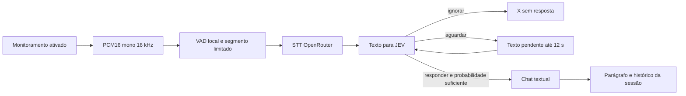

# Arquitetura do MVP

`StudyWhisper.Core` não depende de UI ou dispositivos: VAD, WAV, pipeline, orçamento, relógio do popover e adaptadores de API. `StudyWhisper.App` é WPF com `NotifyIcon` de WinForms; o host é WPF. `Microphone` usa WinMM em modo de evento, evitando chamadas de áudio dentro de callbacks nativos. Testes usam um `HttpMessageHandler` que nunca abre conexão e um `IStudyApi` fictício.

## Fluxo

A captura mantém quadros de 20 ms. Produção remonta blocos de 32 ms para Silero ONNX CPU, com pré-roll de até 320 ms, início após dois blocos com probabilidade suficiente, histerese e fim após 800 ms de silêncio com margem final de 256 ms. Limites de segmento usam sobreposição de 256 ms. A implementação RMS permanece apenas para comparação offline/demonstração. Silero não identifica falante, intenção ou pergunta. A entrada usa o dispositivo de gravação padrão do Windows. Leia [triagem neural e métricas](AUDIO-TRIAGE.md) para definições, margens e perdas possíveis.

São quatro buffers nativos de 640 bytes e no máximo 30 segundos por segmento. O pipeline admite uma solicitação por vez e até dois segmentos pendentes com expiração de 30 s. Excesso substitui e zera o pendente mais antigo; pausa/limpar/sair esvazia a fila. Retomar não envia segmentos anteriores à pausa. Buffers de PCM e WAV são limpos no consumo, pausa e descarte. Base64, chave e texto usam strings gerenciadas: não há promessa de remoção física imediata da RAM pelo GC.

## Cancelamento e memória

Uma geração e um `CancellationTokenSource` protegem cada execução. Pausar e limpar avançam a geração, cancelam tarefas e recusam resultados antigos, inclusive de mock que ignora o token. Pausa não apaga histórico; limpar apaga histórico e texto incompleto. Configurar modelos pausa e mantém histórico. A memória é habilitada por padrão e inclui as últimos dez pares completos de pergunta e resposta, com perguntas até 4.000 caracteres e respostas até 6.000. A sessão mantém no máximo 30 respostas.

O JEV recebe critérios para responder apenas a perguntas claras de estudo, aguardar fala incompleta e ignorar enunciados/comentários/interjeições/comandos sem pergunta. `answers.action` deve ser `choice`, com label reconhecido e probabilidades finitas entre 0 e 1, somando aproximadamente 1. Só `responder` com probabilidade pelo menos 0,65 chama chat. Esse limiar é uma decisão inicial do MVP, não uma medida de precisão calibrada. Resposta vazia ou formato inválido falham sem exibir conteúdo remoto de erro.

## Janelas e instalação

Círculo e popover são topmost e `WS_EX_NOACTIVATE`, com `ShowActivated=false` e `WM_MOUSEACTIVATE` retornando `MA_NOACTIVATE`. Configurações ganha foco apenas quando aberta por ação do usuário. O círculo ancora à área de trabalho da tela principal; acompanha mudanças dessa área. O app não implementa arraste, escolha de monitor ou garantias sobre fullscreen exclusivo.

Configurações suporta 580 × 450 até 660 × 740 DIP e usa rolagem. O popover cabe na área disponível abaixo do círculo. Seu relógio não consome tempo em hover/captura de mouse; rolagem e clique reiniciam o tempo. Respostas novas preservam a posição de leitura se o mouse estiver no painel.

O instalador Inno Setup é por usuário, com runtime incluído. Inicialização opcional usa somente `HKCU\Software\Microsoft\Windows\CurrentVersion\Run\StudyWhisper`; nenhum registro é alterado nos testes. A desinstalação remove essa entrada. O build usa manifest de DPI para WPF; o aviso de DPI do analisador WinForms é suprimido porque WinForms fornece apenas a bandeja.

## Monitor vetorial 0.1.4

SpeechGate e Pipeline emitem eventos tipados sem áudio/texto. FlowState mantém resultados por etapa e separa atividade de entrada/fila da chamada ativa. Controller serializa publicação, recusa gerações/pipelines antigos e coalesce atualizações de Spectrum (FFT local a 10 Hz). OrbWindow renderiza formas WPF e glifos, com timer decorativo de até 15 Hz só durante atividade, respeito à preferência de movimento e nenhuma ativação automática de janela. Veja [contrato visual e limites](VISUAL-MONITOR.md).

## Indicador circular 0.1.5

O overlay permanece 72 × 72 DIP em toda etapa. OrbWindow seleciona uma única LensScene pelos mesmos eventos de FlowState; o nome legado Expanded representa apenas detalhe ativo, não expansão física. Desenho externo e cenas internas usam clipping circular, com fade de 150 ms só da nova cena. Filtro/microfluxo, STT/glifos, decisão JEV e geração se alternam dentro do círculo. A fila é um pequeno badge interno e um tooltip. Popover e NOACTIVATE permanecem. O modelo/API/VAD/espectro e preflight Visual C++ não mudam nesta correção. O código anterior foi arquivado em artifacts/StudyWhisper-0.1.4-source.zip. [Contrato visual atual](VISUAL-MONITOR.md).

Pesquisa, Markdown, estilos e diagnóstico de limites: veja [Conversa 0.1.6](CONVERSATION.md).
